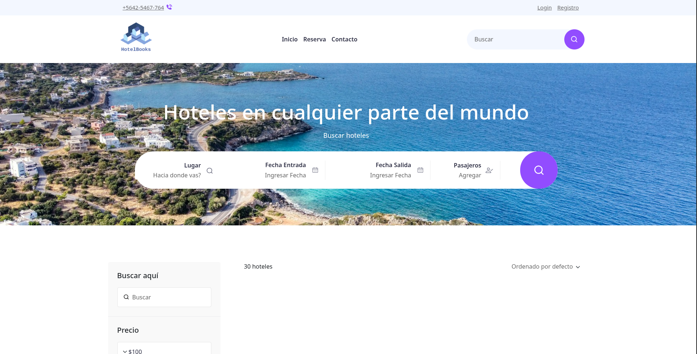
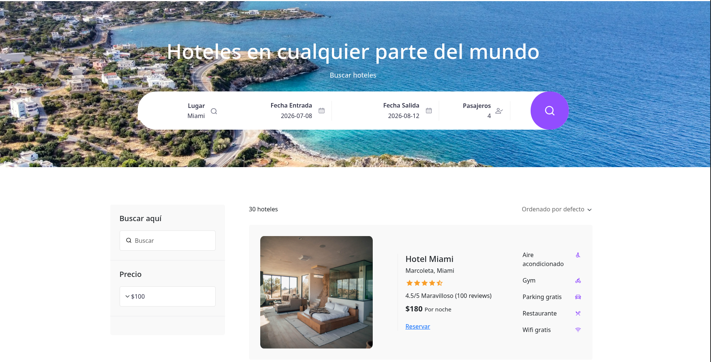

# Proyecto Hoteles 

[](https://www.docker.com/)
[](https://angular.io/)
[](https://spring.io/projects/spring-boot)
[](https://www.mysql.com/)
[](#licencia)

## Descripción

**Proyecto Hoteles** es una aplicación fullstack de búsqueda y reserva de hoteles que implementa una arquitectura de microservicios. Combina una interfaz Angular moderna con múltiples backends Spring Boot especializados y una base de datos MySQL relacional. El proyecto está diseñado enfocado en la consulta de disponibilidad de hoteles, gestión de servicios alojados y reseñas de usuarios.

## Demo

- **Frontend:** `http://localhost:4200`
- **Hotel Microservicio:** `http://localhost:8084`
- **Services Microservicio:** `http://localhost:8081`
- **Reviews Microservicio:** `http://localhost:8082`
- **MySQL:** `localhost:3307`

### Capturas de Pantalla

#### 1. Pantalla principal de la aplicación


#### 2. Filtrado de hoteles

##### Hotel California


##### Hotel Transilvania


##### Hotel Miami



## Características principales

- Búsqueda de hoteles por ciudad y fechas
- Información de hoteles con servicios incluidos
- Sistema de calificaciones y reseñas de usuarios
- Arquitectura de microservicios desacoplados
- Base de datos relacional con procedures almacenados
- Comunicación inter-microservicios con RestTemplate
- Interfaz responsiva con Angular 17
- Contenedores Docker para despliegue reproducible
- Spring Boot 4 con Spring Data JPA

---

## Arquitectura

Proyecto construido con una arquitectura de microservicios de 3 capas:

### Servicios (Backends)

1. **Hotel Service** (Puerto 8084)
   - Orquestación central de datos de hoteles
   - Agregación de información desde otros microservicios
   - Búsqueda de disponibilidad con filtros de ciudad y fechas
   - Consulta de servicios y reseñas asociados a los hoteles

2. **Hotel Services Service** (Puerto 8081)
   - Gestión de servicios disponibles en hoteles
   - Recuperación de amenidades por hotel
   - Persistencia en base de datos especializada

3. **Reviews Service** (Puerto 8082)
   - Gestión de calificaciones y reseñas de hoteles
   - Cálculo de promedios de calificaciones
   - Información de huéspedes y opiniones

### Frontend

**Angular 17 SPA**
- Componentes reutilizables
- Servicios para consumo de APIs REST
- Interfaz intuitiva para búsqueda y visualización de hoteles
- Integración con Bootstrap 5 para estilos responsivos

### Base de datos

**MySQL 8**
- Tablas normalizadas para hoteles, ciudades, direcciones, servicios, reseñas
- Procedures almacenados para consultas optimizadas
- Relaciones referentes entre entidades
- Persistencia con volumen Docker

### Flujo de datos

1. El usuario interactúa con la aplicación Angular (búsqueda, filtros).
2. Angular realiza peticiones HTTP al **Hotel Service** (8084).
3. El **Hotel Service** orquesta:
   - Consulta de disponibilidad a su base de datos
   - Llamada al **Services Microservice** para obtener servicios
   - Llamada al **Reviews Microservice** para obtener calificaciones
4. Los datos agregados retornan al frontend en formato JSON.
5. Angular renderiza la información de forma visual y responsiva.

---

## Tecnologías usadas

| Capa | Herramienta | Propósito |
|---|---|---|
| Frontend | Angular 17 | SPA con interfaz moderna |
| Frontend | Bootstrap 5 | Estilos y componentes responsivos |
| Backend | Spring Boot 4 | API REST y lógica de negocio |
| Backend | Spring Data JPA | Persistencia con ORM |
| Backend | RestTemplate | Comunicación inter-microservicios |
| Base de datos | MySQL 8 | Persistencia relacional |
| Contenedores | Docker / Docker Compose | Despliegue reproducible |
| Scripting | Maven Wrapper | Compilación y dependencias |

---

## Estructura de carpetas

```text
ProyectoHoteles/
├── hotel/                           # Microservicio principal de orquestación
│   ├── src/main/java/com/hotelsbook/
│   │   ├── entity/                  # Entidades JPA (HotelAvailable, City)
│   │   ├── repository/              # Repositorios JPA
│   │   ├── service/                 # Servicios y clientes HTTP
│   │   ├── controller/              # Controladores REST
│   │   └── dto/                     # Data Transfer Objects
│   ├── src/main/resources/
│   │   ├── application.properties   # Configuración Spring
│   │   └── static/                  # Archivos estáticos (si aplica)
│   ├── pom.xml                      # Dependencias Maven
│   └── Dockerfile                   # Imagen Docker
│
├── con-hotels-services/             # Microservicio de servicios de hoteles
│   ├── src/main/java/com/hotelsbook/services/
│   │   ├── entity/                  # Entidades JPA (HotelServiceEntity)
│   │   ├── repository/              # Repositorio JPA
│   │   ├── service/                 # Lógica de negocio
│   │   ├── controller/              # Controladores REST
│   │   └── dto/                     # Data Transfer Objects
│   ├── src/main/resources/
│   │   ├── application.properties   # Configuración Spring
│   │   └── logback-spring.xml       # Configuración de logs
│   ├── pom.xml                      # Dependencias Maven
│   └── Dockerfile                   # Imagen Docker
│
├── reviews/                         # Microservicio de reseñas y calificaciones
│   ├── src/main/java/com/hotelsbook/reviews/
│   │   ├── entity/                  # Entidades JPA (ReviewEntity)
│   │   ├── repository/              # Repositorio JPA
│   │   ├── service/                 # Lógica de negocio
│   │   ├── controller/              # Controladores REST
│   │   └── dto/                     # Data Transfer Objects
│   ├── src/main/resources/
│   │   ├── application.properties   # Configuración Spring
│   │   └── logback-spring.xml       # Configuración de logs
│   ├── pom.xml                      # Dependencias Maven
│   └── Dockerfile                   # Imagen Docker
│
├── frontend/                        # Aplicación Angular
│   ├── src/
│   │   ├── app/
│   │   │   ├── components/          # Componentes Angular (header, footer, etc.)
│   │   │   ├── services/            # Servicios HTTP (HotelsService)
│   │   │   ├── interface/           # Interfaces TypeScript
│   │   │   ├── app.component.*      # Componente raíz
│   │   │   ├── app.routes.ts        # Rutas de la aplicación
│   │   │   └── app.config.ts        # Configuración global
│   │   ├── index.html               # Página HTML principal
│   │   ├── main.ts                  # Punto de entrada Angular
│   │   └── styles.scss              # Estilos globales
│   ├── package.json                 # Dependencias npm
│   ├── angular.json                 # Configuración Angular CLI
│   ├── tsconfig.json                # Configuración TypeScript
│   └── Dockerfile                   # Imagen Docker
│
├── docker-compose/
│   ├── docker-compose.yml           # Orquestación de servicios
│   └── db_hotelsbook.sql            # Script de inicialización MySQL
│
└── README.md                        # Este archivo
```

---

## Requisitos previos

- Docker y Docker Compose (versión 1.29+)
- Node.js >= 18 y npm >= 9
- Java 17 o superior
- Maven 3.8+
- MySQL 8.0 (si ejecutas sin Docker)
- Angular 17

---

## Instalación

### Opción 1: Con Docker Compose 

#### Paso 1: Clonar el repositorio

```bash
git clone https://github.com/<tu-usuario>/ProyectoHoteles.git
cd ProyectoHoteles
```

#### Paso 2:  Construir las imágenes Docker de los microservicios

```bash
cd hotel
docker build -t hotel-service .

cd ../con-hotels-services
docker build -t hotel-services-service .

cd ../reviews
docker build -t reviews-service .
```

#### Paso 3: Levantar los servicios con Docker Compose

```bash
cd ../docker-compose
docker compose up -d
```

Este comando levantará los contenedores utilizando las imágenes previamente construidas:

- MySQL (localhost:3307)
- Hotel Service (localhost:8084)
- Services Microservice (localhost:8081)
- Reviews Microservice (localhost:8082)

#### Paso 4: Verificar el estado

```bash
docker compose ps
```

#### Paso 5: Acceder a la aplicación

Espera 10-15 segundos para que todos los servicios inicien completamente. Luego abre en tu navegador:

```text
http://localhost:4200
```

---

### Opción 2: Ejecución manual (Desarrollo local)

#### Backend - Hotel Service

```bash
cd hotel
./mvnw spring-boot:run
```

El servicio estará disponible en `http://localhost:8084`

#### Backend - Services Microservice

```bash
cd con-hotels-services
./mvnw spring-boot:run
```

El servicio estará disponible en `http://localhost:8081`

#### Backend - Reviews Microservice

```bash
cd reviews
./mvnw spring-boot:run
```

El servicio estará disponible en `http://localhost:8082`

#### Frontend

```bash
cd frontend
npm install
ng serve
```

Accede desde tu navegador a `http://localhost:4200`

> **Nota:** Requiere una instancia de MySQL en ejecución. Ajusta las propiedades de conexión en `application.properties` de cada microservicio.

---

## Variables de entorno

### Docker Compose (`.env` o directamente en `docker-compose.yml`)

```env
MYSQL_DATABASE=db_hotelsbook
MYSQL_ROOT_PASSWORD=admin
MYSQL_USER=hotelsuser
MYSQL_PASSWORD=hotelpass
```

### Configuración de Backend (`application.properties`)

**Hotel Service (`hotel/src/main/resources/application.properties`):**

```properties
spring.application.name=hotel-service
spring.datasource.url=jdbc:mysql://db:3306/db_hotelsbook?allowPublicKeyRetrieval=true&useSSL=false
spring.datasource.username=root
spring.datasource.password=admin
spring.datasource.driver-class-name=com.mysql.cj.jdbc.Driver
spring.jpa.database-platform=org.hibernate.dialect.MySQLDialect
spring.jpa.hibernate.ddl-auto=none
server.port=8084
microservice.services.url=http://services:8081/api/hotels/services
microservice.reviews.url=http://reviews:8082/api/hotels/reviews
server.url=http://localhost:8084
```

**Services Microservice:**

```properties
spring.application.name=con-hotels-services
spring.datasource.url=jdbc:mysql://db:3306/db_hotelsbook?allowPublicKeyRetrieval=true&useSSL=false
spring.datasource.username=root
spring.datasource.password=admin
server.port=8081
```

**Reviews Microservice:**

```properties
spring.application.name=reviews
spring.datasource.url=jdbc:mysql://db:3306/db_hotelsbook?allowPublicKeyRetrieval=true&useSSL=false
spring.datasource.username=root
spring.datasource.password=admin
server.port=8082
```

### Ajuste para ejecución local (sin Docker)

Si ejecutas sin Docker, cambia las URLs de conexión a base de datos:

```properties
# En todos los application.properties
spring.datasource.url=jdbc:mysql://localhost:3306/db_hotelsbook?allowPublicKeyRetrieval=true&useSSL=false
```

---

## Endpoints principales

### Hotel Service (Puerto 8084)

| Recurso | Método | Ruta | Descripción |
|---|---|---|---|
| Hoteles | GET | `/api/hotels/available` | Buscar hoteles disponibles |

**Parámetros de búsqueda:**
- `startDate` (Date, formato YYYY-MM-DD): Fecha de llegada
- `endDate` (Date, formato YYYY-MM-DD): Fecha de salida
- `cityName` (String): Nombre de la ciudad

**Ejemplo:**
```text
GET /api/hotels/available?startDate=2024-06-01&endDate=2024-06-10&cityName=California
```

**Respuesta:**
```json
[
    {
        "averageCalification": 4.5,
        "cityName": "California",
        "description": "Hotel ubicado en el centro del estado de California",
        "id": 1,
        "name": "Hotel California",
        "number": "541",
        "picture": "http://localhost:8084/images/hotel1.jpg",
        "price": 300.0,
        "services": [
            {
                "serviceId": 3,
                "serviceName": "Aire acondicionado"
            },
            {
                "serviceId": 5,
                "serviceName": "Gym"
            },
            {
                "serviceId": 2,
                "serviceName": "Parking gratis"
            },
            {
                "serviceId": 4,
                "serviceName": "Restaurante"
            },
            {
                "serviceId": 1,
                "serviceName": "Wifi gratis"
            }
        ],
        "street": "Los Ángeles"
    }
]
```

### Services Microservice (Puerto 8081)

| Recurso | Método | Ruta | Descripción |
|---|---|---|---|
| Servicios | GET | `/api/hotels/services/{hotelIds}` | Obtener servicios de hoteles |

**Parámetros:**
- `hotelIds` (String): IDs separados por comas. Ej: `1,2,3`

**Ejemplo:**
```text
GET /api/hotels/services/1,2,3
```

**Respuesta:**
```json
[
    {
        "hotelId": 1,
        "hotelName": "Hotel California",
        "services": [
            {
                "serviceId": 3,
                "serviceName": "Aire acondicionado"
            },
            {
                "serviceId": 5,
                "serviceName": "Gym"
            },
            {
                "serviceId": 2,
                "serviceName": "Parking gratis"
            },
            {
                "serviceId": 4,
                "serviceName": "Restaurante"
            },
            {
                "serviceId": 1,
                "serviceName": "Wifi gratis"
            }
        ]
    },
    {
        "hotelId": 2,
        "hotelName": "Hotel Transilvania",
        "services": [
            {
                "serviceId": 3,
                "serviceName": "Aire acondicionado"
            },
            {
                "serviceId": 5,
                "serviceName": "Gym"
            },
            {
                "serviceId": 2,
                "serviceName": "Parking gratis"
            },
            {
                "serviceId": 4,
                "serviceName": "Restaurante"
            },
            {
                "serviceId": 1,
                "serviceName": "Wifi gratis"
            }
        ]
    },
    {
        "hotelId": 3,
        "hotelName": "Hotel Miami",
        "services": [
            {
                "serviceId": 3,
                "serviceName": "Aire acondicionado"
            },
            {
                "serviceId": 5,
                "serviceName": "Gym"
            },
            {
                "serviceId": 2,
                "serviceName": "Parking gratis"
            },
            {
                "serviceId": 4,
                "serviceName": "Restaurante"
            },
            {
                "serviceId": 1,
                "serviceName": "Wifi gratis"
            }
        ]
    }
]
```

### Reviews Microservice (Puerto 8082)

| Recurso | Método | Ruta | Descripción |
|---|---|---|---|
| Calificaciones | GET | `/api/hotels/reviews/{hotelIds}` | Obtener calificaciones promedio |

**Parámetros:**
- `hotelIds` (String): IDs separados por comas. Ej: `1,2,3`

**Ejemplo:**
```text
GET /api/hotels/reviews/1,2,3
```

**Respuesta:**
```json
[
    {
        "hotelId": 1,
        "averageCalification": 4.5
    },
    {
        "hotelId": 2,
        "averageCalification": 4.5
    },
    {
        "hotelId": 3,
        "averageCalification": 4.5
    }
]
```

---

## Esquema de Base de Datos

Las siguientes tablas están disponibles en MySQL:

### address
Almacena direcciones asociadas a los hoteles.

- id (INT, PK, AI)
- street (VARCHAR(100))
- number (INT)
- city_id (INT, FK)

### city
Almacena las ciudades disponibles en el sistema.

- id (INT, PK, AI)
- name (VARCHAR(100))
- country (VARCHAR(100))

### hotel
Almacena la información principal de los hoteles.

- id (INT, PK, AI)
- name (VARCHAR(200))
- price (DECIMAL(10,2))
- picture (VARCHAR(255))
- description (VARCHAR(500))
- address_id (INT, FK)

### service
Almacena los servicios o amenidades disponibles en hoteles.

- id (INT, PK, AI)
- nombre (VARCHAR(200))

### service_has_hotel
Tabla intermedia para la relación muchos-a-muchos entre hoteles y servicios.

- service_id (INT, FK)
- hotel_id (INT, FK)

### review
Almacena reseñas y calificaciones de hoteles.

- id (INT, PK, AI)
- calification (DECIMAL(3,1))
- description (VARCHAR(255))

### hotel_has_review
Tabla intermedia que relaciona hoteles con sus reseñas.

- hotel_id (INT, FK)
- review_id (INT, FK)

### room
Almacena habitaciones disponibles en el sistema.

- id (INT, PK, AI)
- number (INT)
- description (VARCHAR(200))
- number_passenger (INT)

### reservation
Almacena información de reservas realizadas por huéspedes.

- id (INT, PK, AI)
- date_in (DATE)
- date_out (DATE)
- room_id (INT, FK)

### reservation_has_hotel
Tabla intermedia que relaciona reservas con hoteles.

- reservation_id (INT, FK)
- hotel_id (INT, FK)

### Procedures Almacenados

- **GetAvailableHotelsByCity** - Retorna hoteles disponibles en una ciudad para un rango de fechas
- **GetServicesByHotels** - Retorna todos los servicios asociados a un conjunto de hoteles
- **GetAverageCalificationByHotel** - Retorna la calificación promedio por hotel

---

## Comunicación Inter-Microservicios

El flujo de comunicación síncrona entre servicios se realiza mediante **RestTemplate**:

1. **Hotel Service** (orquestador) recibe una solicitud de búsqueda
2. Ejecuta consulta de disponibilidad en su BD
3. Llama a **Services Microservice** vía HTTP para obtener amenidades
4. Llama a **Reviews Microservice** vía HTTP para obtener calificaciones
5. Agrega toda la información y retorna al cliente

Este patrón garantiza:
- Separación de responsabilidades
- Escalabilidad independiente de cada microservicio
- Reutilización de datos sin duplicación

---

## Mejoras futuras

- Autenticación y autorización con JWT
- Sistema de reservas transaccionales
- Notificaciones en tiempo real con WebSockets
- Búsqueda avanzada con filtros adicionales (rango de precios, calificación mínima)
- Paginación de resultados
- Despliegue en Kubernetes
- Internacionalización (i18n) en frontend
- Despliegue en AWS / Azure / DigitalOcean


---

## Buenas prácticas implementadas

- **Arquitectura de Microservicios:** Servicios desacoplados y especializados  
- **Spring Data JPA:** Persistencia con ORM estándar  
- **Procedures Almacenados:** Consultas optimizadas en BD  
- **DTOs:** Transferencia de datos sin exponer entidades  
- **RestTemplate:** Comunicación inter-microservicios HTTP  
- **Logging Estructurado:** SLF4J con Logback  
- **Control de Errores:** Respuestas de error con códigos HTTP apropiados  
- **CORS Configurado:** Comunicación segura frontend-backend  
- **Docker Compose:** Infraestructura reproducible  
- **Maven Wrapper:** Ejecución consistente sin instalación global  
- **Separación de capas:** Controller → Service → Repository  
- **Configuración externalizables:** application.properties  

---

## Autor

- **Nombre:** Frank Andrés
- **Proyecto:** Proyecto Hoteles
- **Perfil:** Fullstack Angular + Spring Boot Microservicios

---

